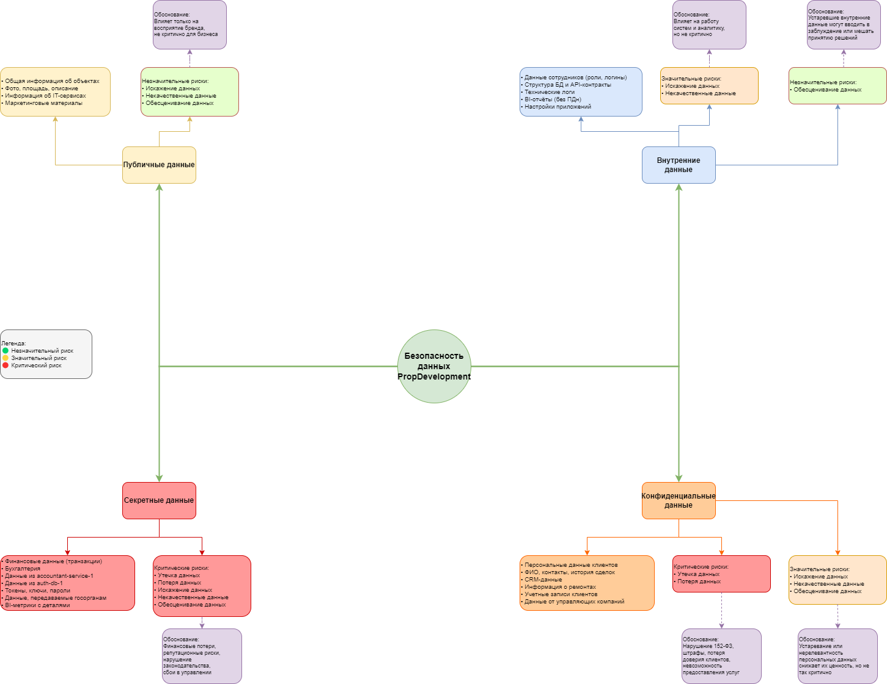

# Задание 1. Разработка проверочного листа по безопасности данных

---

## Классификация данных PropDevelopment по стандартам ISO/IEC 27001 и 27002

На основе анализа диаграммы и описания системы PropDevelopment, данные компании были классифицированы в соответствии со стандартами ISO/IEC 27001 и 27002 по следующим четырём категориям: публичные, внутренние, конфиденциальные и секретные.

### Классификация данных PropDevelopment по стандартам ISO/IEC 27001 и 27002

На основе анализа диаграммы и описания системы PropDevelopment, данные компании были классифицированы в соответствии со стандартами ISO/IEC 27001 и 27002 по следующим четырём категориям: публичные, внутренние, конфиденциальные и секретные.

| Категория данных           | Примеры данных                                                                                                      |
|----------------------------|----------------------------------------------------------------------------------------------------------------------|
| **Публичные данные**       | Общая информация об объектах недвижимости (фото, площадь, описание); информация об IT-сервисах; маркетинговые материалы |
| **Внутренние данные**      | Данные сотрудников (роли, логины без паролей); структура БД и API-контракты; технические логи; BI-отчёты (без ПДн); настройки приложений |
| **Конфиденциальные данные**| Персональные данные клиентов и собственников (ФИО, контакты, история сделок); CRM-данные; информация о ремонтах; учетные записи клиентов; данные от управляющих компаний |
| **Секретные данные**       | Финансовые данные (транзакции, бухгалтерия); данные из accountant-service-1 и auth-db-1; токены, ключи, пароли; данные, передаваемые госорганам; BI-метрики с деталями |

---

## Оценка рисков по категориям данных в PropDevelopment

На основе анализа архитектуры и типов обрабатываемых данных в компании PropDevelopment, ниже приведена классификация рисков по четырём категориям данных согласно стандартам ISO/IEC 27001 и 27002. Для оценки использовалась шкала: незначительный — значительный — критический.

### 1. Публичные данные

| Риск                 | Обоснование                                                                                 | Оценка          |
|----------------------|---------------------------------------------------------------------------------------------|-----------------|
| Искажение данных     | Пользователь может получить недостоверную информацию о недвижимости или услугах            | Незначительный  |
| Некачественные данные| Ошибки или устаревшая информация могут повлиять на восприятие бренда                        | Незначительный  |
| Обесценивание данных | Информация теряет актуальность (например, проданные объекты продолжают отображаться)        | Незначительный  |

### 2. Внутренние данные

| Риск                 | Обоснование                                                                                     | Оценка         |
|----------------------|-------------------------------------------------------------------------------------------------|----------------|
| Искажение данных     | Может привести к сбоям в работе систем или аналитике                                            | Значительный   |
| Некачественные данные| Ошибки в логах, API, конфигурациях могут повлиять на надёжность сервисов                       | Значительный   |
| Обесценивание данных | Устаревшие внутренние данные могут вводить в заблуждение или мешать принятию решений            | Незначительный |

### 3. Конфиденциальные данные

| Риск                 | Обоснование                                                                                                     | Оценка        |
|----------------------|-----------------------------------------------------------------------------------------------------------------|---------------|
| Утечка данных         | Нарушение закона (например, 152-ФЗ), возможны штрафы, потеря доверия клиентов                                 | Критический   |
| Потеря данных         | Утрата информации о клиентах и сделках приведёт к невозможности предоставления услуг                          | Критический   |
| Искажение данных      | Приводит к ошибочной идентификации клиентов, сбоям в CRM и недовольству                                         | Критический   |
| Некачественные данные | Ошибки в данных влияют на обслуживание клиентов и выполнение юридически значимых действий                       | Критический   |
| Обесценивание данных  | Устаревание или нерелевантность персональных данных снижает их ценность, но не так критично                    | Значительный  |

### 4. Секретные данные

| Риск                 | Обоснование                                                                                             | Оценка        |
|----------------------|---------------------------------------------------------------------------------------------------------|---------------|
| Утечка данных         | Возможны финансовые потери, репутационные риски, нарушение законодательства и контрактов               | Критический   |
| Потеря данных         | Утрата бухгалтерских и юридически значимых данных нарушит работу всей компании                         | Критический   |
| Искажение данных      | Приводит к финансовым ошибкам, нарушению отчётности и принятию неверных решений                         | Критический   |
| Некачественные данные | Ошибки в финансовых или юридических данных ведут к сбоям в управлении компанией                         | Критический   |
| Обесценивание данных  | Даже кратковременное снижение ценности может нарушить стратегические и инвестиционные процессы          | Критический   |

---

## Результаты анализа в виде mindmap

