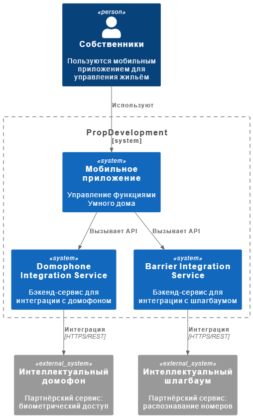
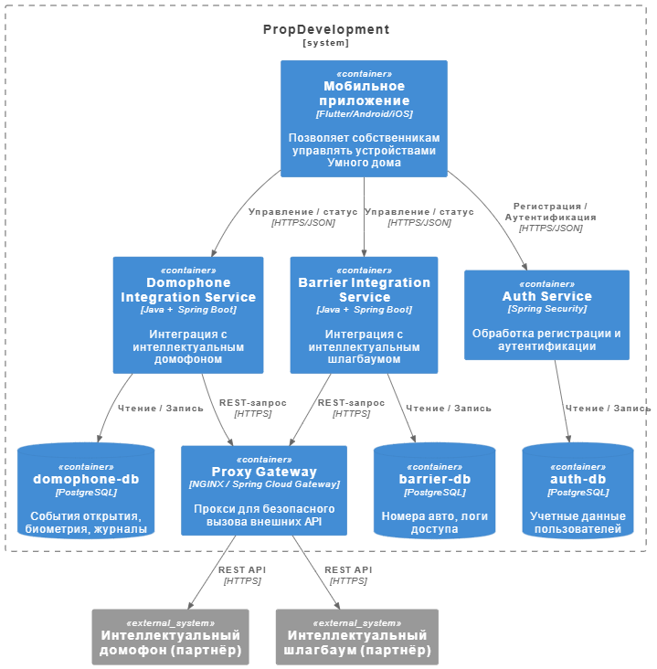

# 1. Диаграмма контекста

## Описание

На данной диаграмме представлена контекстная модель взаимодействия пользователей, внутренних и внешних систем PropDevelopment. Она отражает, как собственники взаимодействуют с мобильным приложением, которое, в свою очередь, интегрировано с внешними партнёрскими сервисами «Умного дома».

### Основные элементы диаграммы:

- **Собственники** — пользователи, которые используют мобильное приложение для управления функциями Умного дома.
- **Мобильное приложение** — основной канал взаимодействия между собственниками и ИТ-сервисами PropDevelopment.
- **Domophone Integration Service** — внутренний сервис PropDevelopment для интеграции с партнёрским сервисом интеллектуального домофона.
- **Barrier Integration Service** — внутренний сервис PropDevelopment для интеграции с партнёрским сервисом интеллектуального шлагбаума.
- **Интеллектуальный домофон** — внешний партнёрский сервис, управляющий доступом в здание по биометрии.
- **Интеллектуальный шлагбаум** — внешний партнёрский сервис, управляющий доступом по номеру автомобиля.

## Диаграмма

## Комментарии

- В рамках архитектуры PropDevelopment используются два внутренних промежуточных сервиса, которые обеспечивают контроль, безопасность и трансформацию данных между мобильным приложением и внешними API.
- Взаимодействие с внешними сервисами осуществляется по защищённому протоколу (например, HTTPS с шифрованием TLS).
- Собственники не взаимодействуют напрямую с внешними сервисами — все вызовы проходят через проверенные компоненты инфраструктуры компании.

---

# 2. Диаграмма контейнеров

## Описание

На этой диаграмме контейнеров показано, как в архитектуре PropDevelopment интегрируются новые компоненты для управления функциями «Умного дома». 
**Note:** Диаграмма создана только для новых сервисов, поскольку не удалось открыть диаграмму, предоставленную в описании проекта.

### Новые компоненты:

- **Мобильное приложение**
  - Используется собственниками для управления интеллектуальными устройствами (домофоном и шлагбаумом).
  - Осуществляет запросы к внутренним сервисам через HTTPS.

- **Domophone Integration Service**
  - Внутренний сервис, обрабатывающий запросы к партнёрскому домофону.
  - Хранит события открытия, биометрические ID, журналы доступа.

- **Barrier Integration Service**
  - Сервис интеграции с интеллектуальным шлагбаумом.
  - Хранит номера автомобилей, списки доступа и события въезда/выезда.

- **Auth Service**
  - Отвечает за регистрацию и аутентификацию пользователей.
  - Используется мобильным приложением при входе или создании аккаунта.

- **Proxy Gateway**
  - Отдельный шлюз (прокси), через который внутренние сервисы взаимодействуют с внешними API партнёров.
  - Обеспечивает безопасный выход во внешнюю среду (HTTPS, фильтрация, аудит).

- **Базы данных**
  - У каждого сервиса — собственная база данных (PostgreSQL), хранящая логи, идентификаторы доступа и данные пользователей.

## Диаграмма

## Комментарии

Все связи между сервисами и базами данных реализованы по внутренним защищённым каналам.

Внешние вызовы осуществляются только через прокси.

Выбор PostgreSQL обоснован универсальностью и поддержкой как структурированных данных (таблицы), так и событий (логи, JSON).

Использование HTTPS обеспечивает безопасную передачу данных при интеграциях.

---

# 3. Требования к внешним интеграциям

## 1. Требования к безопасности

- **Шифрование каналов связи**  
  Все взаимодействия между системами PropDevelopment и внешними сервисами партнёров должны происходить через HTTPS с использованием TLS 1.2+.

- **End-to-end шифрование**  
  Данные должны быть зашифрованы как при передаче, так и при хранении. Это минимизирует риски утечки, перехвата или подделки данных.

- **Запрет на передачу персональных данных**  
  В рамках интеграции с внешними платформами (интеллектуальный домофон, шлагбаум) **не допускается передача персональных данных** (ФИО, контактной информации, идентификаторов пользователей и т.п.). Только обезличенные атрибуты доступа (например, хеши, ID устройств, номера авто).

- **Изоляция внешнего доступа**  
  Взаимодействие с внешними сервисами должно осуществляться через выделенный **прокси-шлюз** (Gateway), который фильтрует, логирует и контролирует трафик.

- **Логирование и аудит доступа**  
  Все вызовы внешних API должны логироваться. Аудит включает:
  - идентификатор вызывающего сервиса;
  - время запроса;
  - результат (успешно/ошибка);
  - идентификатор операции (например, ID доступа).

---

## 2. Протоколы аутентификации и авторизации

- **Внутренняя аутентификация (в PropDevelopment)**  
  Мобильное приложение использует `Auth Service` для регистрации и аутентификации пользователей. Используется:
  - JWT-токены (JSON Web Token)
  - HTTPS
  - RBAC + ABAC (см. ниже)

- **Аутентификация внешних API**  
  Все запросы от PropDevelopment к внешним системам партнёров должны:
  - подписываться API-ключами или JWT-токенами;
  - иметь проверку IP или цифровую подпись;
  - использовать ограниченный срок действия токенов.

- **Авторизация внутри системы**  
  В PropDevelopment применяется **Role-Based Access Control (RBAC)** и **Attribute-Based Access Control (ABAC)**.

---

## 3. Организация взаимодействия систем

- **Инициатор запросов**:  
  Инициатором взаимодействия является мобильное приложение, которое обращается к внутренним микросервисам (`domophone-integration-service` и `barrier-integration-service`).

- **Точка выхода во внешнюю среду**:  
  Все запросы к сторонним API проходят через `Proxy Gateway`, который:
  - реализует HTTPS;
  - ограничивает диапазон IP/URI;
  - логирует обращения.

- **Тип взаимодействия**:  
  Синхронные REST-запросы (HTTPS + JSON). Возможна поддержка webhook для получения асинхронных событий (например, результат открытия двери/шлагбаума).

- **Обработка ошибок и отказоустойчивость**:  
  - Повторная попытка запроса при временном недоступности;
  - Circuit breaker / timeout в proxy;
  - SLA от партнёров — обязательное требование при подключении.

---

## Резюме

Интеграции с внешними сервисами должны быть построены на принципах Zero Trust, исключать работу с персональными данными и обеспечивать безопасное соединение через прокси. Аутентификация и авторизация строятся на современных протоколах и принципах ограниченного доступа.
