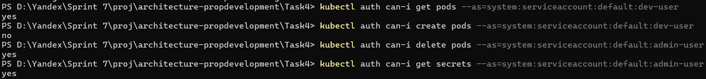

# Задание 4 — Настройка RBAC в Kubernetes (Minikube)

---

## Таблица ролей

| Роль        | Права роли                                                                 | Группы пользователей          |
|-------------|------------------------------------------------------------------------------|-------------------------------|
| admin       | Полный доступ к кластеру: все действия над всеми ресурсами (`*` verbs)      | platform-engineers, devops    |
| developer   | Только просмотр pods, services, deployments в неймспейсе `default`          | developers                    |

## Цель
Настроить разграничение доступа к кластеру Kubernetes с использованием RBAC, реализовав две роли: `admin` и `developer`, и проверить работу ролей на практике в Minikube.

---

## Структура решения

| Файл/Папка | Назначение |
|------------|------------|
| `03_create-users.ps1` | Скрипт создания сервисных аккаунтов |
| `04_create-roles.ps1` | Скрипт создания ролей (Role и ClusterRole) |
| `05_bind-users.ps1` | Скрипт привязки аккаунтов к ролям |
| `roles/admin-clusterrole.yaml` | Определение роли с полным доступом (admin) |
| `roles/developer-role.yaml` | Определение роли с доступом только на чтение |
| `bindings/admin-binding.yaml` | ClusterRoleBinding для admin-user |
| `bindings/developer-binding.yaml` | RoleBinding для dev-user |

---

## Этапы настройки

### 1. Запуск Minikube

```powershell
minikube start --driver=hyperv
```

### 2. Создание пользователей (сервисных аккаунтов)

```powershell
.\03_create-users.ps1
```

Созданы:
- admin-user
- dev-user

### 3. Создание ролей

```powershell
.\04_create-roles.ps1
```

- admin-role — полный доступ (ClusterRole)
- developer-role — доступ только на чтение pods/services/deployments в default

### 4. Привязка ролей к пользователям

```powershell
.\05_bind-users.ps1
```

- admin-user привязан к admin-role через ClusterRoleBinding
- dev-user привязан к developer-role через RoleBinding

### 5. Проверка доступа

Команды проверки:

```powershell
kubectl auth can-i get pods --as=system:serviceaccount:default:dev-user
kubectl auth can-i create pods --as=system:serviceaccount:default:dev-user
kubectl auth can-i delete pods --as=system:serviceaccount:default:admin-user
kubectl auth can-i get secrets --as=system:serviceaccount:default:admin-user
```

Результат проверки — см. скриншот:



---
